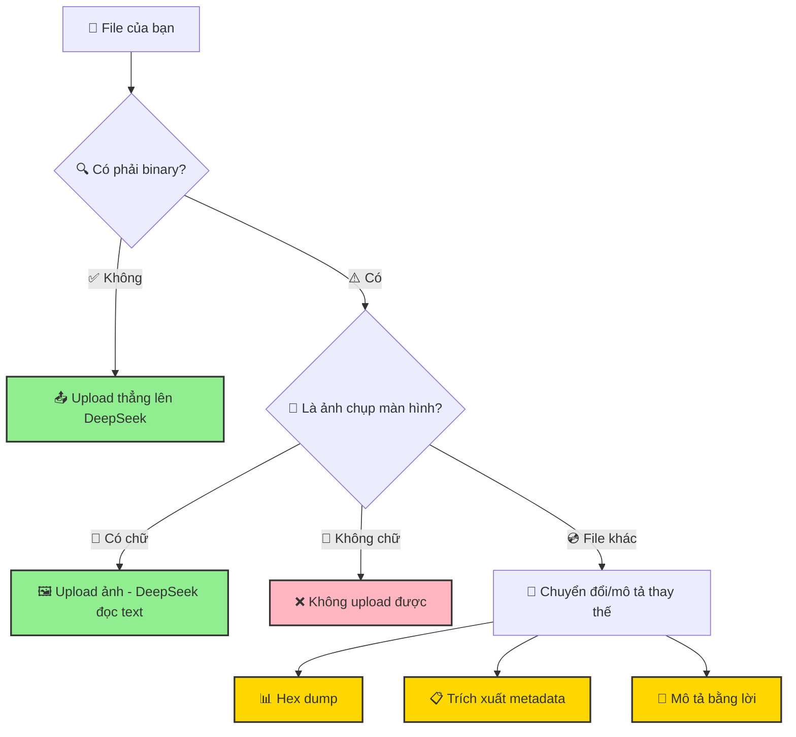

# Hướng dẫn Upload File lên DeepSeek 🚀

## Giới thiệu
Tài liệu hướng dẫn cách xử lý và upload các loại file khác nhau lên DeepSeek AI.

## Quy trình xử lý file

### Sơ đồ quyết định


## Chi tiết các bước

### 1. File không phải binary (📄 TEXT)
```yaml
Các định dạng được hỗ trợ:
  - .txt, .csv, .json, .xml
  - .py, .js, .cpp (mã nguồn)
  - .pdf, .docx (có text)
  - .xlsx (dữ liệu bảng)

Cách xử lý:
  - Upload trực tiếp lên DeepSeek
  - Hoặc copy-paste nội dung
  - DeepSeek tự động đọc và phân tích
```

### 2. File ảnh chụp màn hình (📸)
```yaml
Yêu cầu:
  - Ảnh rõ nét, đủ sáng
  - Có chứa text cần đọc
  - Không bị méo, bóng đổ

DeepSeek có OCR:
  - Đọc được chữ trong ảnh
  - Không hiểu nội dung hình ảnh
  - Chỉ dùng cho ảnh có text
```

### 3. File binary khác (💿)
```yaml
Các định dạng KHÔNG hỗ trợ:
  - .exe, .dll (chương trình)
  - .zip, .rar (nén)
  - .mp3, .mp4 (đa phương tiện)
  - .bin (dữ liệu nhị phân)

Giải pháp thay thế:
  - Hex dump: chuyển sang text
  - Trích xuất metadata
  - Mô tả bằng lời
```

## Các phương pháp thay thế

### 📊 Hex dump
```bash
# Linux/Mac
xxd file.exe > file_hex.txt
hexdump -C file.exe > file_hex.txt

# Windows (với Git Bash)
xxd file.exe > file_hex.txt
```

### 📋 Trích xuất metadata
```python
# extract_info.py
import os
import hashlib
import datetime

def get_file_info(file_path):
    stats = os.stat(file_path)
    return {
        'tên_file': os.path.basename(file_path),
        'kích_thước': f"{stats.st_size:,} bytes",
        'ngày_tạo': datetime.datetime.fromtimestamp(stats.st_ctime),
        'ngày_sửa': datetime.datetime.fromtimestamp(stats.st_mtime),
        'md5': hashlib.md5(open(file_path, 'rb').read()).hexdigest()
    }

# Sử dụng
info = get_file_info('example.exe')
print(info)
```

### 📝 Mô tả bằng lời
```markdown
Ví dụ mô tả file:
"Tôi có file setup.exe:
- Dung lượng 25MB
- Là trình cài đặt phần mềm
- Được viết bằng C++
- Có các tham số dòng lệnh: --silent, --path
- Cần phân tích chức năng"
```

## Bảng tóm tắt

| Loại file | Định dạng | Khả năng | Cách xử lý |
|-----------|-----------|----------|------------|
| **Văn bản** | .txt, .csv, .json | ✅ Tốt | Upload thẳng |
| **Mã nguồn** | .py, .js, .cpp | ✅ Tốt | Upload thẳng |
| **Tài liệu** | .pdf, .docx | ✅ Khá | Upload thẳng |
| **Bảng tính** | .xlsx | ⚠️ Trung bình | Upload thẳng |
| **Ảnh có chữ** | .jpg, .png | ⚠️ OCR | Upload ảnh |
| **Ảnh không chữ** | .jpg, .png | ❌ Không | Không dùng được |
| **File nén** | .zip, .rar | ❌ Không | Giải nén trước |
| **Chương trình** | .exe, .dll | ❌ Không | Mô tả thay thế |

## Mẹo và lưu ý

### ✅ NÊN
```yaml
- Dùng file .txt cho dữ liệu thuần
- Export Excel sang CSV trước khi upload
- Chụp ảnh rõ nét nếu cần OCR
- Mô tả chi tiết nếu không upload được
```

### ❌ KHÔNG NÊN
```yaml
- Upload file binary trực tiếp
- Upload ảnh mờ, chữ nhỏ
- Upload file nén chưa giải nén
- Quên kiểm tra encoding tiếng Việt
```

## Liên hệ và hỗ trợ

Nếu cần hỗ trợ thêm, vui lòng:
- 📧 Email: support@example.com
- 💬 Chat: https://t.me/yourchannel
- 🌐 Website: https://deepseek.com

---

*Cập nhật lần cuối: Tháng 3, 2024*
